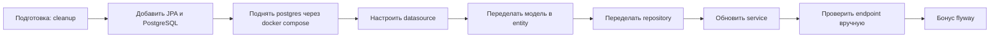

# Следующий этап: перевод сервиса на PostgreSQL + Spring Data JPA

## Зачем это делать сейчас

У проекта уже есть хорошая база:

- REST-контроллеры в [UrlController](src/main/java/com/example/url_shortener/controller/UrlController.java:14) и [RedirectController](src/main/java/com/example/url_shortener/controller/RedirectController.java:11)
- бизнес-логика в [UrlService](src/main/java/com/example/url_shortener/service/UrlService.java:16)
- пока что данные хранятся в памяти через [UrlRepository](src/main/java/com/example/url_shortener/repository/UrlRepository.java:12)

Логичный следующий шаг: оставить текущее API, но заменить хранение данных на настоящую БД.

---

## Что изучить перед началом(тут важно просто ознакомиться, не закапываться. ЭТо нужно что бы ты знал с чем работаешь, а не шел вслепую)

### 1. Основы SQL и PostgreSQL

- что такое таблица, строка, первичный ключ
- `SELECT`, `INSERT`, `UPDATE`, `DELETE`
- уникальные ограничения и индексы

### 2. Базовые аннотации JPA

- `@Entity`, `@Table`, `@Id`, `@GeneratedValue`, `@Column`
- как класс в Java связывается с таблицей в БД

### 3. Spring Data JPA

- зачем нужен `JpaRepository`
- как работают методы вида `findBy...`, `existsBy...`, `deleteBy...`
- что возвращает `Optional` и зачем он нужен вместо null

### 4. Транзакции

- что такое транзакция и зачем она нужна
- аннотация `@Transactional` — когда и где ставить

### 5. Docker Compose

- что такое контейнер
- как поднять PostgreSQL локально через docker-compose.yml

### Что почитать

- официальный гайд Spring по Data JPA или видео или хабр-статья
- по sql - базовые команды и синтаксис
- пару статей про Docker Compose (как поднять БД локально) что такое контейнер тоже посмотреть
- короткую статью про Flyway миграции

---

## Основная задача

Перевести существующий сервис с in-memory хранения на PostgreSQL через Spring Data JPA.

Важно: поведение текущих endpoint должно остаться прежним.

---

## Пошаговый план задания

### Шаг 0. Подготовка

- создать новую ветку от мастера после того как вмержишь свои изменения туда: `git checkout -b feature/postgres-migration`

### Шаг 1. Добавить зависимости

В [pom.xml](pom.xml:32) добавить:

- Spring Data JPA
- PostgreSQL Driver

Текущие зависимости Web и Validation оставить.

### Шаг 2. Поднять PostgreSQL через Docker Compose

Создать docker-compose.yml с сервисом `postgres`:

- порт `5432`
- имя БД, пользователь и пароль через переменные окружения
- volume для сохранения данных
- Проверить что бд поднялась через `docker ps` и можно подключиться через Dbeaver

### Шаг 3. Настроить приложение

В [application.yaml](src/main/resources/application.yaml:1) добавить:

- `spring.datasource.*` (url, username, password)
- `spring.jpa.*` (hibernate.ddl-auto, show-sql)

Swagger и текущие настройки не удалять.

### Шаг 4. Сделать сущность JPA

Переделать [ShortUrl](src/main/java/com/example/url_shortener/model/ShortUrl.java:13):

- добавить `id` (Long) как primary key с `@GeneratedValue`
- отметить класс как `@Entity`
- сделать `shortCode` уникальным через `@Column(unique = true)` так де добавить constraint в бд

### Шаг 5. Переделать репозиторий

Заменить текущий [UrlRepository](src/main/java/com/example/url_shortener/repository/UrlRepository.java:12) на интерфейс Spring Data:

- наследование от `JpaRepository<ShortUrl, Long>`
- методы:
    - `Optional<ShortUrl> findByShortCode(String shortCode)`
    - `boolean existsByShortCode(String shortCode)`
    - `void deleteByShortCode(String shortCode)`

### Шаг 6. Обновить сервис

Обновить [UrlService](src/main/java/com/example/url_shortener/service/UrlService.java:16):

- использовать новый репозиторий
- обработать `Optional` — вместо проверки на null использовать `.orElseThrow() или .orElse(null)` - почитай про эти методы
- добавить `@Transactional` на метод удаления (Spring Data `deleteBy*`)
- сохранить текущие ошибки `404`, `409`, `410`
- не менять контракт ответов

### Шаг 7. Проверить API вручную

Проверить через Swagger UI (`http://localhost:8080/swagger-ui.html`), что работают:

- создание ссылки (`POST /api/v1/urls`)
- список ссылок (`GET /api/v1/urls`)
- получение по shortCode (`GET /api/v1/urls/{shortCode}`)
- удаление (`DELETE /api/v1/urls/{shortCode}`)
- редирект (`GET /{shortCode}`)
- перезапустить приложение и убедиться, что данные сохранились. Раньеш данные пропадали, так как были в памяти. Теперь они должны сохраняться в PostgreSQL и быть доступны после перезапуска.

---

## Бонус-трек: миграции Flyway

Если основная часть работает, добавить Flyway:

- зависимость в pom.xml
- миграцию `src/main/resources/db/migration/V1__init_schema.sql`

В миграции создать таблицу `short_urls` с уникальностью и индексом по `short_code`.

После подключения Flyway — убрать `hibernate.ddl-auto` из конфигурации (Flyway теперь управляет схемой).

---

## Критерии готовности

1. Приложение запускается с PostgreSQL из docker-compose.yml
2. Текущие CRUD и redirect endpoint работают как раньше
3. Данные не пропадают после перезапуска приложения
4. Уникальность `shortCode` обеспечена на уровне БД
5. В сервисе используется `Optional` (не проверка на null)
6. Проект собирается без ошибок
7. Бонус: Flyway миграция применяется автоматически при старте

---

## Схема выполнения

